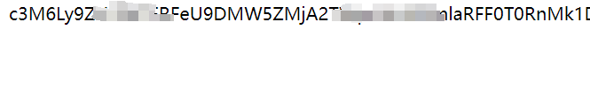
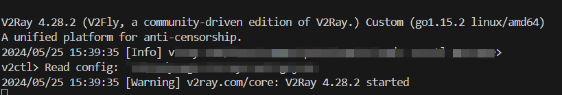
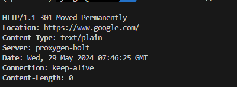

# 服务器无ROOT配置VPN
仅供学习使用
## 流程
- [安装v2ray](https://github.com/v2ray/v2ray-core)
```bash
$ unzip v2ray-linux-64.zip -d ~/v2ray
```
- 访问订阅链接获得base64编码的ss，类似于下图

- 复制这一长串base64转化为ss
```bash
$ echo 'BASE64_ENCODED_STRING' | base64 -d > ./subscription.txt
```
- 运行ss2v2ray.py转化为config
```bash
$ python ss2v2ray.py
```
- 创建一个启动脚本 start_v2ray.sh
```bash 
$ echo -e '#!/bin/sh\n~/v2ray/v2ray -config ~/v2ray/config.json' > ~/start_v2ray.sh
$ chmod +x ~/start_v2ray.sh
```
- 在你的应用程序或系统中设置代理，指向 V2Ray 的监听端口（默认是 1080）,添加到~/.bashrc中
```bashrc
export ALL_PROXY="socks5://127.0.0.1:1080" # socks5协议
export HTTP_PROXY="http://127.0.0.1:8888" # http协议
export HTTPS_PROXY="http://127.0.0.1:8888" # http协议
```
- 单独配置git 
```bash
$ git config --global http.proxy socks5://127.0.0.1:1080
$ git config --global https.proxy socks5://127.0.0.1:1080
# 取消配置
$ git config --global --unset http.proxy 
$ git config --global --unset https.proxy
```
- 单独配置pip, 下面的命令需要你在配置bashrc之前
```
$ pip install -U 'requests[socks]'
```
## 使用
```bash 
$ ~/start_v2ray.sh
```
成功开启v2ray脚本如下图所示

另开一个终端，输入下面指令，成功访问谷歌
```bash
$ curl -x socks5://127.0.0.1:1080 -I http://www.google.com
```


